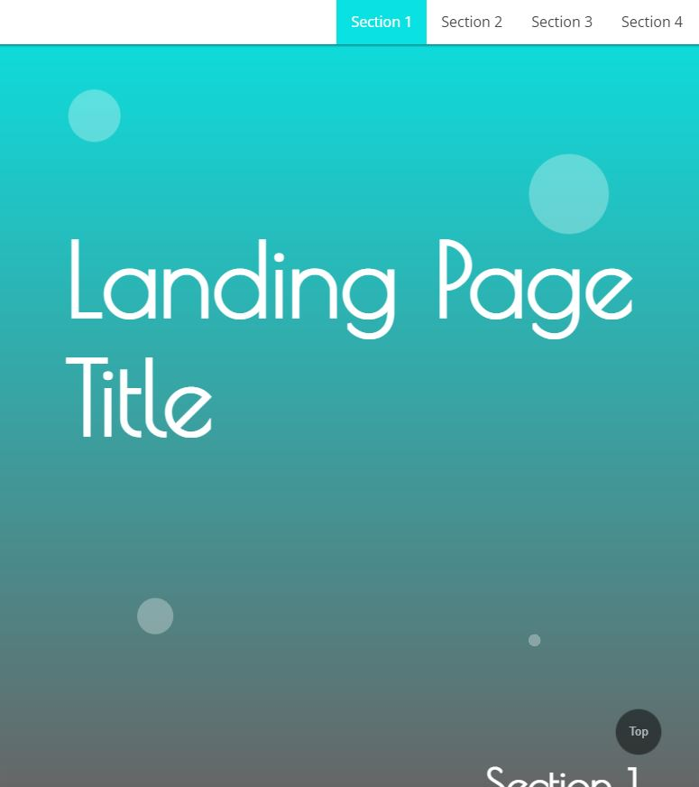

# Landing-page

This is a landing page designed to fullfil the requirements of the second project of [Udacity's](https://www.udacity.com/course/front-end-web-developer-nanodegree--nd0011) Front End Nanodegree program.

## Table of Contents

- [Introduction](#ntroduction)
- [Links](#Links)
- [Screenshot](#Screenshot)
- [Highlights](#Highlights)
- [Challenges](#Challenges)
- [Ideas](#Ideas)
- [Acknowledgements](#Acknowledgements)

## Introduction

This landing page was built to practice using JavaScript to add functionality to a styled HTML document. The JavaScript in this application builds a navigation bar and updates styles based on which parts of the page are in view.

## Links

- GitHub - [https://github.com/LanceStasinski/FEND-02-LandingPage](https://github.com/LanceStasinski/FEND-02-LandingPage)
- Deployed - [https://lancestasinski.herokuapp.com/landing-page](https://lancestasinski.herokuapp.com/landing-page)

## Screenshot

## Highlights

- Responsive and animated UI built from CSS3 with media queries and keyframes
- Dynamic navigation bar built with JavaScript that is only shown within 2 seconds of scrolling or if the top of the page is in view.
- Styles that update depending on which parts of the page are in view
- Button that smoothly scrolls back up to the top of the page

## Challenges

The most challenging part of this project was creating a timer with `useTimeout()` that would hide the navigation bar after two seconds of scrolling. The problem was that new scrolling events would not reset the time. I fixed this by initializing the timer before the event listener using the `let` keyword. Then, the event listener clears the timer and re-initializes it for every scroll event.

## Ideas

This landing page could be improved by generating dynamic sections from some input data - perhaps from a form or from a database; however, this is beyond the scope of this small project built to practice the basics of response design and JavaScript.

## Acknowledgements

- [Udacity's](https://www.udacity.com/course/front-end-web-developer-nanodegree--nd0011) front end nanodegree program for this assignment and for providing feedback
